## Michał Muzyka 2.3 – Sprawozdanie Zadanie 1

#### Uruchamiam klaster z węzłem głównym i 3 węzłami roboczymi z pluginem CNI Calico i sterownikiem Docker. Dla każdego węzła przydzielana jest pamięć RAM 1900 MB i 2 CPU w celu zaoszczędzenia zasobów urządzenia.

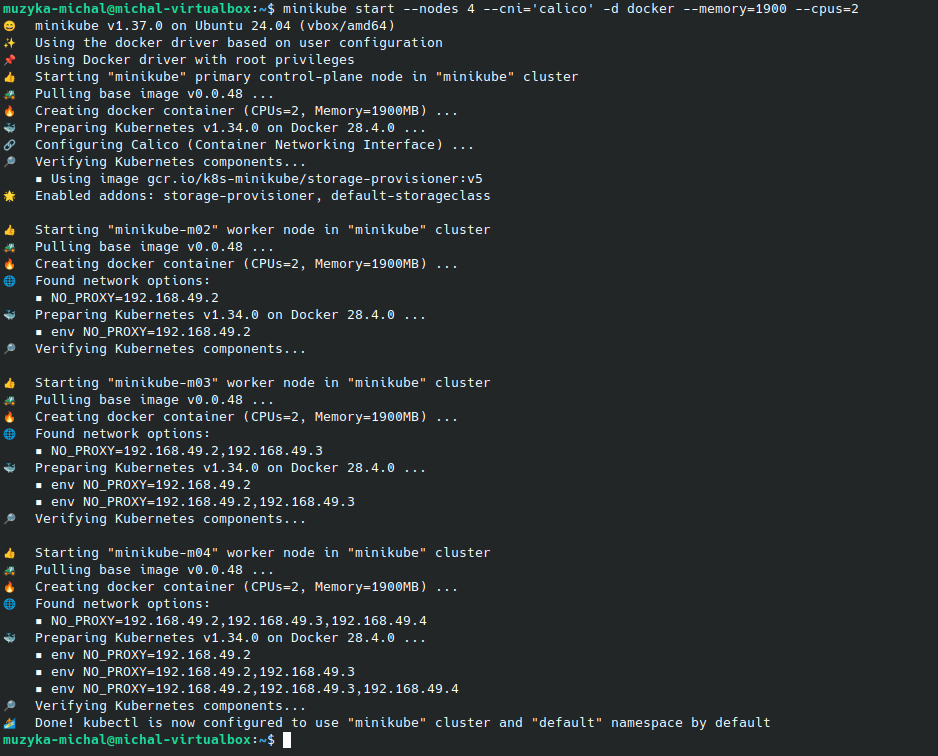

#### Wyświetlam utworzone węzły. Oznaczam jeden z węzłów etykietą zone=backend. Weryfikuję to.

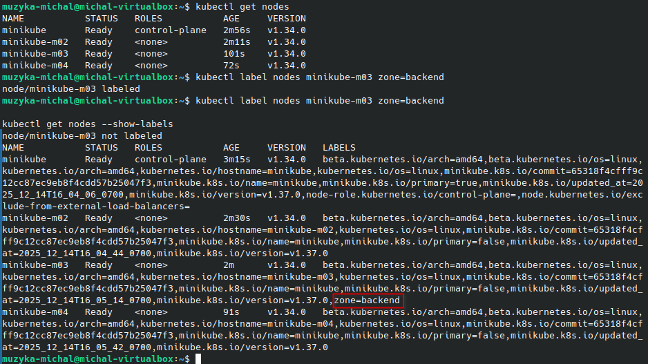

#### Tworzę pliki YAML dla przestrzeni nazw frontend i backend. Do plików dodaję etykietę, aby ułatwić oznaczenie przestrzeni nazw w namespaceSelectorze w NetworkPolicy.

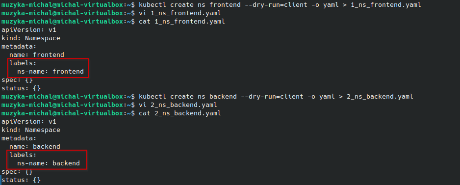

#### Tworzę plik YAML obiektu Deployment o nazwie frontend na bazie obrazu nginx z 3 replikami. Dodaję do pliku sekcję nodeAffinity, aby pody mogły być umieszczane na dowolnym węźle oprócz tego, na którym są pody backend i my-sql. Używam do tego etykiety zone=backend. Określam też minimalne (requests) i maksymalne (limits) zasoby CPU i pamięci, jakie kontener może użyć – 100 MiB i cpu=100m. Przy autoskalerze przy 10 podach nadal będzie wystarczająca ilość zasobów w przestrzeni frontend przy limicie określonym później przez ResourceQuota.

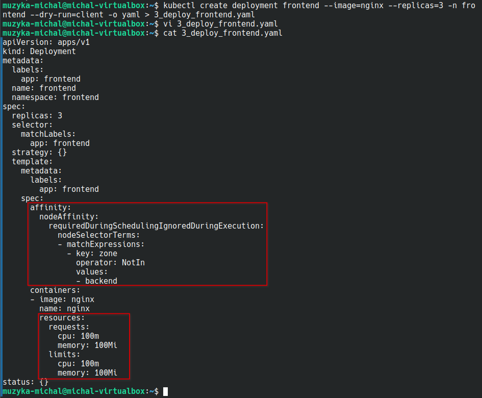

#### Tworzę plik YAML obiektu Deployment o nazwie backend na bazie obrazu nginx z 1 repliką. Dodaję do pliku sekcję nodeAffnity, aby pody mogły znaleźć się na tym samym węźle co my-sql. Używam do tego etykiety zone=backend. Określam też minimalne (requests) i maksymalne (limits) zasoby CPU i pamięci, jakie kontener może użyć – 256 MiB i cpu=200m. Jest to konieczne z powodu dalszej konfiguracji ResourceQuota. Parametry zostały dobrane losowo, ale w zakresie ResourceQuota.

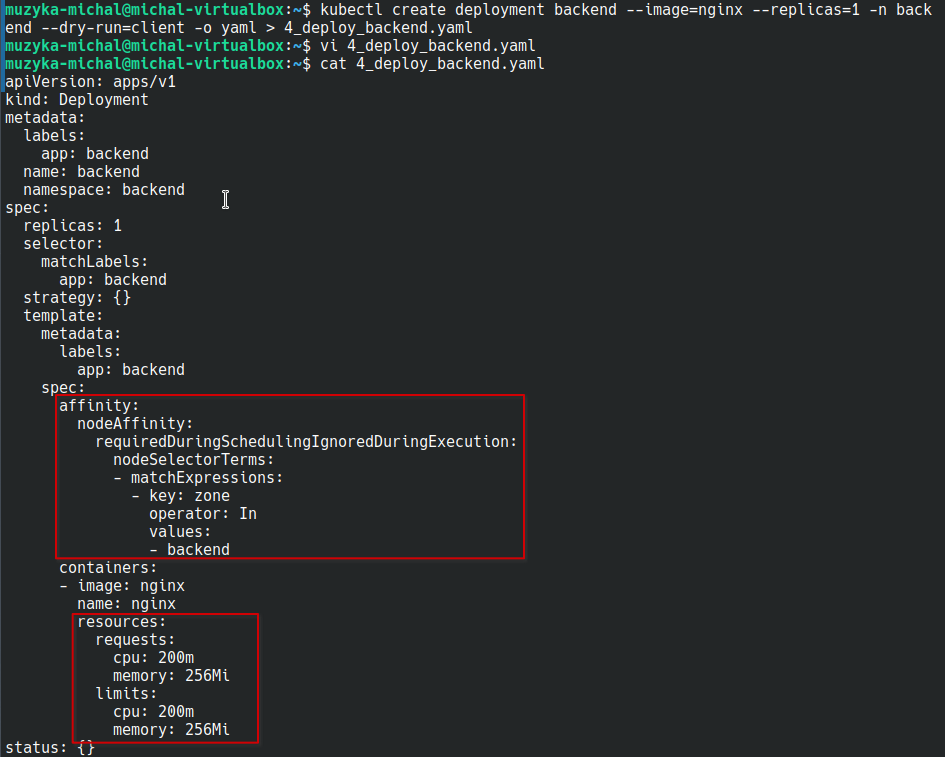

#### Tworzę plik YAML poda o nazwie my-sql na bazie obrazu mysql ze zmienną środowiskową MYSQL_ROOT_PASSWORD=root z hasłem do bazy danych oraz etykietą app=my-sql, która przyda się później dla obiektu NetworkPolicy dotyczącego my-sql. Określam też minimalne (requests) i maksymalne (limits) zasoby CPU i pamięci, jakie kontener może użyć – 512 MiB i cpu=500m. Jest to konieczne z powodu dalszej konfiguracji ResourceQuota. Parametry zostały dobrane losowo, ale w zakresie ResourceQuota.

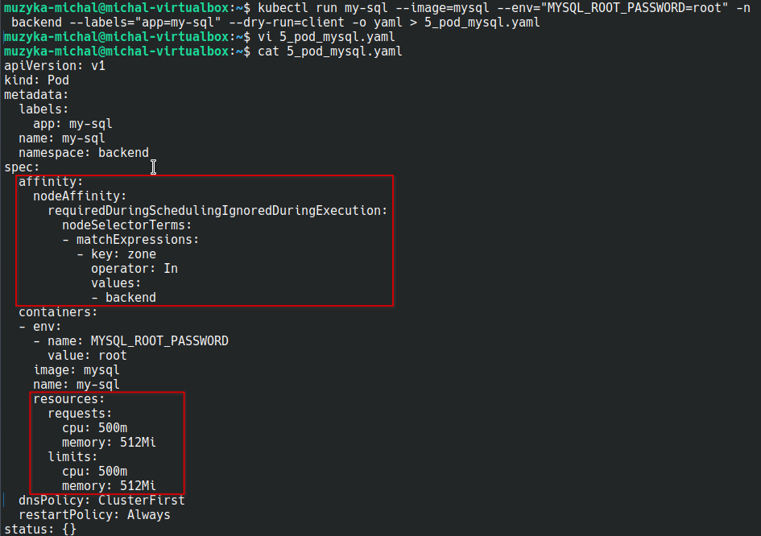

#### Aplikuję pliki YAML przestrzeni nazw, deploymentów i poda.

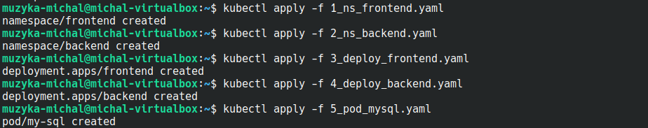

#### Weryfikuję dodane etykiety do przestrzeni nazw.

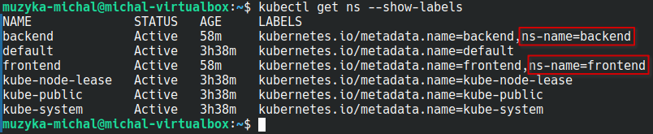

#### Weryfikuję utworzone obiekty Deployment i pody. Wszystkie działają.

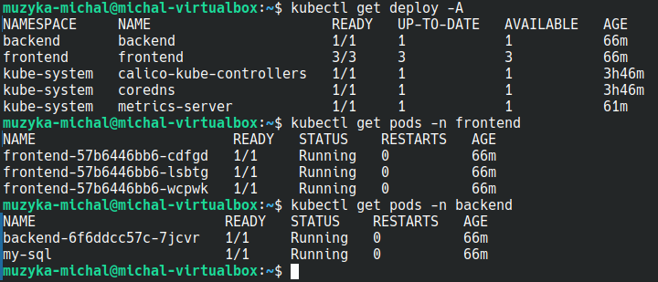

#### Weryfikuję, czy pody Deploymentu frontend są na innych węzłach niż pod my-sql i pod Deploymentu backend i czy te drugie pody są na jednym węźle. Jest poprawnie.

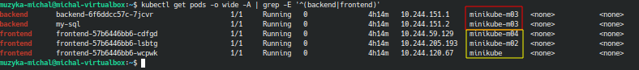

#### Tworzę plik obiektu Service typu NodePort o nazwie frontend-svc dla Deploymentu frontend w przestrzeni nazw frontend. Usługa będzie na porcie 80.

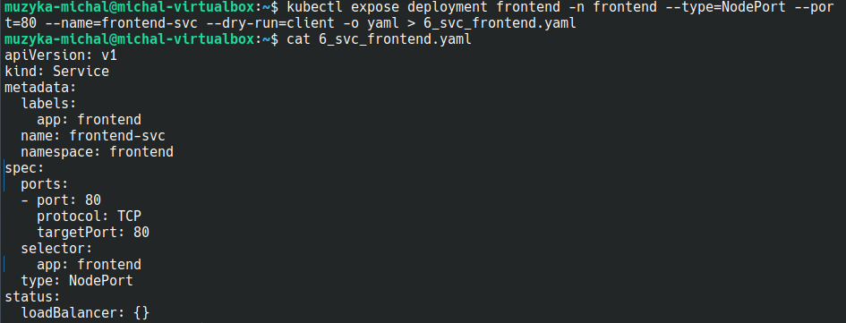

#### Tworzę plik obiektu Service typu ClusterIP o nazwie backend-svc dla Deploymentu backend w przestrzeni nazw backend. Usługa będzie na porcie 80.

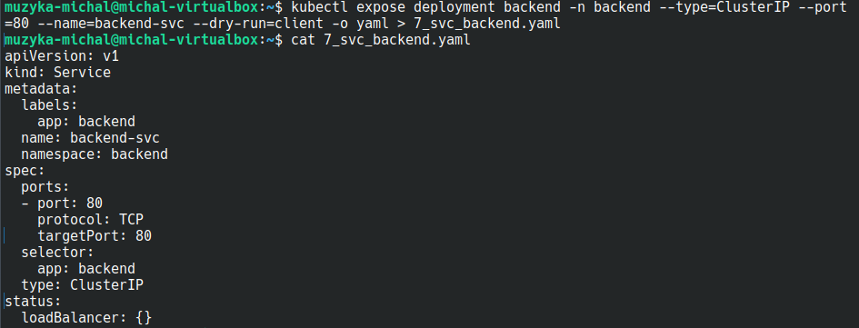

#### Tworzę plik obiektu Service typu ClusterIP o nazwie backend-svc dla poda my-sql w przestrzeni nazw backend. Usługa będzie na porcie 3306.

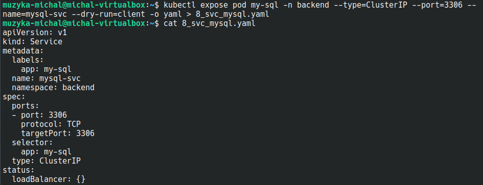

#### Aplikuję pliki usług. 

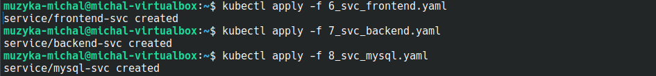

#### Sprawdzam poprawność utworzenia.

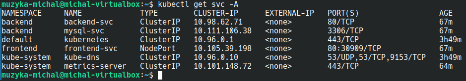

#### Zgodnie z rysunkiem należy ustawić polityki sieciowe dla podów frontend i mysql.

#### Tworzę plik YAML NetworkPolicy dla podów Deploymentu frontend w przestrzeni nazw frontend. Blok z portem UDP i TCP i portami 53 jest konieczny dla DNS czyli rozwiązywania nazw. W Egress, czyli ruchu wychodzącym, pozwalam na ruch wyłącznie do podów Deploymentu backend w przestrzeni nazw backend na port 80. Dla Ingress, czyli ruchu wchodzącego, zezwalam na ruch z Deploymentu backend z przestrzeni nazw backend. Wykorzystałem wcześniej utworzoną etykietę dla przestrzeni nazw backend – ns-name=backend.

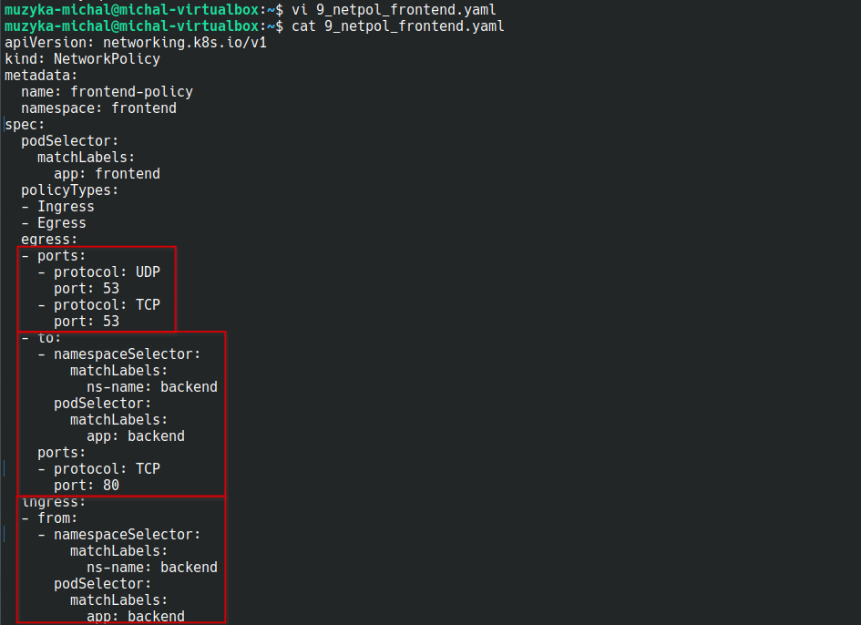

#### Tworzę drugi plik YAML NetworkPolicy dla poda my-sql w przestrzeni nazw backend. Pozwalam na ruch wchodzący Ingress tylko na port 3306 z podów Deploymentu backend z przestrzeni nazw backend (czyli tej samej, więc nie trzeba tego podawać). Wykorzystałem wcześniej utworzoną etykietę dla poda my-sql – app=mysql.

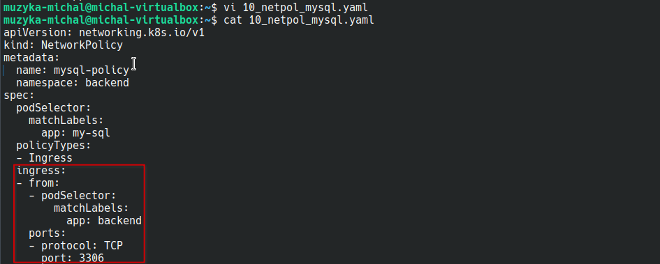

#### Aplikuję pliki YAML polityk sieciowych.

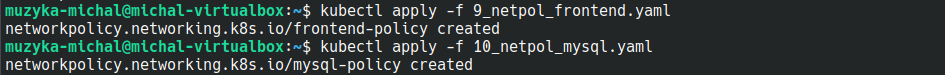

#### Weryfikuję poprawność utworzenia.

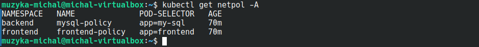

#### Tworzę pliki YAML obiektów ResourceQuota, by ograniczyć liczbę podów i dostępne zasoby dla obydwu przestrzeni nazw. Zgodnie z poleceniem dla przestrzeni frontend ustawiam max. 10 podów, CPU=1 i pamięć RAM 1,5 GiB, a dla przestrzeni nazw backend max. 3 pody, CPU=1 i 1 GiB pamięci RAM.

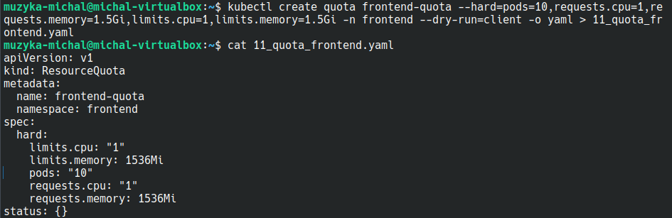

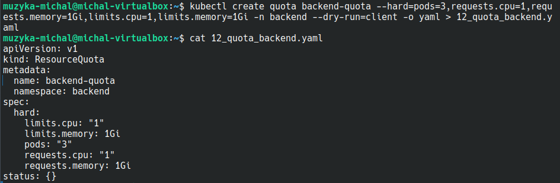

#### Aplikuję pliki YAML obiektów ResourceQuota.

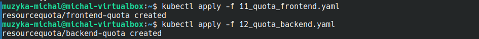

#### Weryfikuję poprawność utworzenia obiektów.

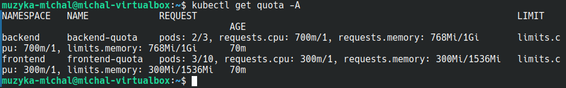

#### Dodaję dodatek serwer metryk potrzebyn do wykonania zadania. Tworzę plik YAML obiektu HorizontalPodAutoscaler dla Deploymentu frontend w przestrzeni nazw frontend. Ustawiam docelowe średnie użycie CPU na 2%, (by szybko przekroczyło tę wartość i zaczęło zwiększać repliki) minimalną liczbę podów 3 i maksymalną liczbę podów 10. Dodaję do wygenerowane pliku pole określające przestrzeń nazw frontend.

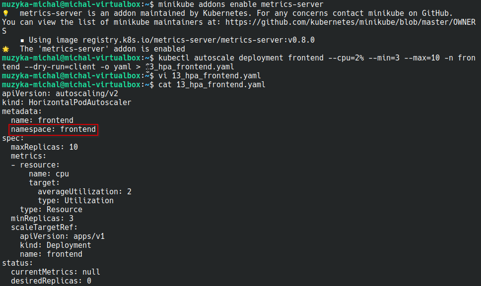

#### Aplikuję plik obiektu. Sprawdzam poprawność utworzenia. Po chwili obiekt zebrał dane i działa.

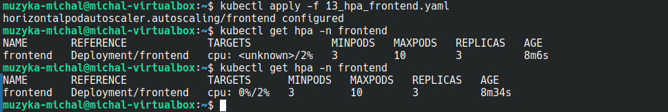

#### Tworzę plik YAML poda generującego obciążenie. Tworzę w przestrzeni nazw backend pod load-generator z etykietą app=backend, co pozwala na komunikację z frontendem zgodnie z polityką sieciową. Wewnątrz kontenera uruchamiam cztery równoległe pętle zapytań do serwisu frontendowego, aby wygenerować wystarczające obciążenie CPU, aby HPA zadziałało. Ustawiam zasoby request i limits poda uwzględniając przy tym wymogi ResourceQuota przestrzeni nazw backend. Aplikuję plik obiektu. Pod działa.

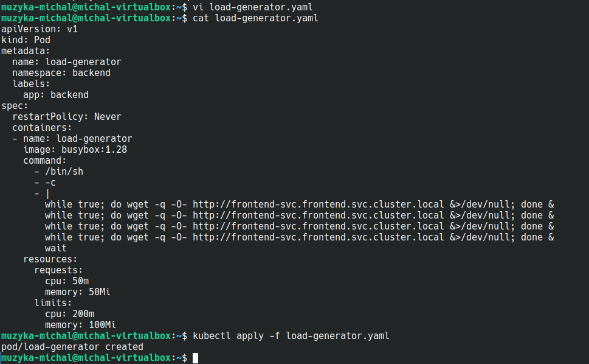

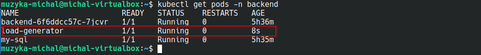

#### Jak widać wartość średniego użycia CPU na 2% szybko została przekroczona i autoskaler zaczął powielać pody frontendu do maksymalnej wartości 10 podów. Po usunięciu poda generującego obciążenie zużycie CPU znowu spadło poniżej 2%, a po pewnym czasie liczba replik zmniejszyła się do minimalnej wartości 3 podów.  

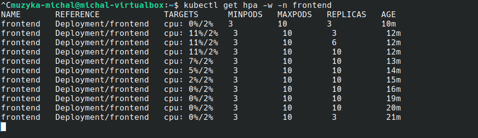

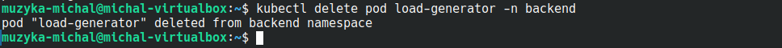

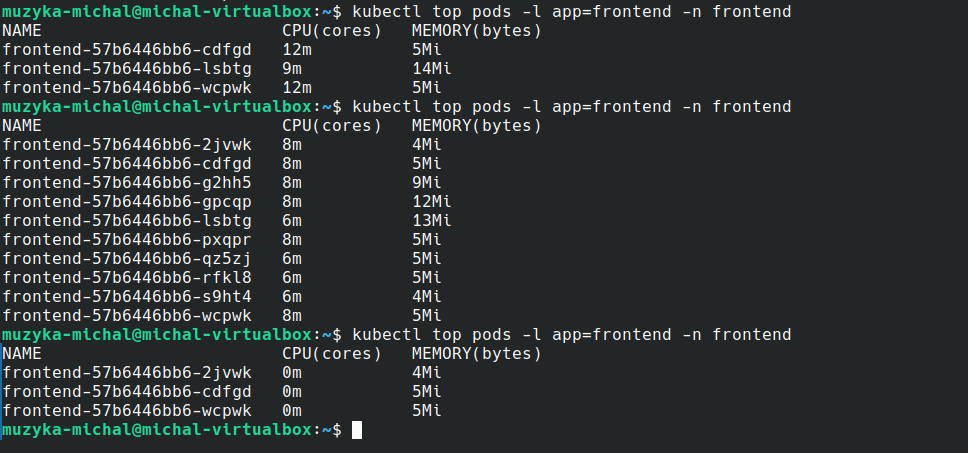

### Pytanie 1. 
Czy możliwe jest dokonanie aktualizacji aplikacji frontend (np. wersji obrazu kontenera) gdy aplikacja jest pod kontrolą opracowanego autoskalera HPA? Proszę do odpowiedzi (TAK lub NIE) dodać link do fragmentu dokumentacji, w którym jest rozstrzygnięta ta kwestia.

#### TAK. Jest to możliwe, ponieważ HPA zarządza jedynie liczbą replik (polem replicas w Deployment), natomiast kontroler Deploymentu zarządza procesem wymiany podów (rollingUpdate). W trakcie aktualizacji kontroler Deploymentu dba o to, aby suma replik w starym i nowym ReplicaSet odpowiadała liczbie wymaganej przez HPA.

Link do dokumentacji: https://kubernetes.io/docs/tasks/run-application/horizontal-pod-autoscale/#autoscaling-during-rolling-update

"Kubernetes lets you perform a rolling update on a Deployment. In that case, the Deployment manages the underlying ReplicaSets for you. When you configure autoscaling for a Deployment, you bind a HorizontalPodAutoscaler to a single Deployment. The HorizontalPodAutoscaler manages the replicas field of the Deployment. The deployment controller is responsible for setting the replicas of the underlying ReplicaSets so that they add up to a suitable number during the rollout and also afterwards."

### Pytanie 2. 

#### Przykładowe parametry strategii rollingUpdate:

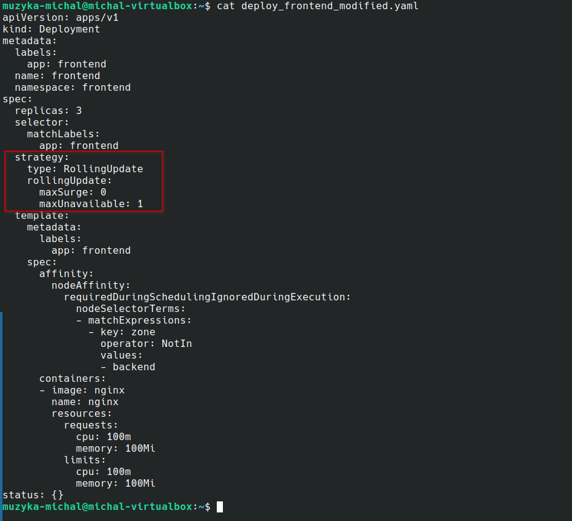

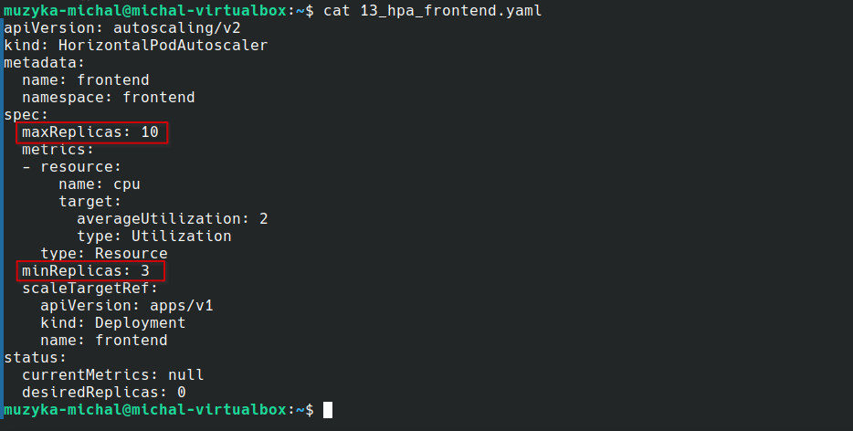

#### Liczba replik Deploymentu jest kontrolowana przez HPA. Wynosi ona nadal od 3 do 10 replik. Do pliku YAML Deploymentu została dodana sekcja ze strategią rollingUpdate. Pole maxSurge zostało ustawione na 0, więc przy aktualizacji żaden dodatkowy pod w przestrzeni nazw frontend nie zostanie utworzony. Ustawienie maxSurge np. 1 spowodowałoby przy HPA max=10 utworzenie 11 poda w przestrzeni nazw frontend, co jest niemożliwe przy obecnym ResourceQuota ustawionym na max 10 podów i CPU=1, gdzie pojedynczy pod moze mieć CPU=100m. Jedynie pamięć RAM nie zostałaby przekroczona. Rozwiazaniem byłoby ustawienie w pliku 3_hpa_frontend.yaml pola maxReplicas na 9, co wraz z maxSurge=1 zapewniłoby płynniejszą aktualizację, ale nie jest to konieczne do spełnienia warunków zadania. Pole maxUnavailable zostało ustawione na 1, a więc przy HPA min=3 pozostają jeszcze dwa działające pody realizujące działanie aplikacji przy aktualizacji. Nie trzeba zmieniać ustawień autoskalera HPA na min=2, ponieważ przy aktualizacji jest możliwe, dopuszczalne, aby liczba aktywnych podów spadła poniżej min w nim określonym.

#### Podsumowując, strategia maxSurge=0 i maxUnavailable=1 spełnia wszystkie wymagania zadania - gwarantuje minimum 2 aktywne pody podczas aktualizacji oraz nie przekracza żadnych limitów ResourceQuota.